# F1 weather tracker

View live version of the website [here](https://larkinz.github.io/F1-weather-tracker/).

Milestone Project 2: Interactive Front-end Development – [Code Institute](https://codeinstitute.net/)

This website was made as my second milestone project for the Code Institute course. The website was created to provide event specific information about the track, the event schedule and especially the weather conditions shortly before the race start for upcoming race events in the 2021 Formula 1 calendar. The project requirements were to create an interactive front-end website using HTML, CSS and JavaScript.

**Remark: because of time restraints I had to change the scope of the project, my initial plan was way too ambitious and required thousands of pieces of data. It would have cost me months to finish, so at the 14th git commit on the 12th of February 2021 I changed the scope and documentation.**

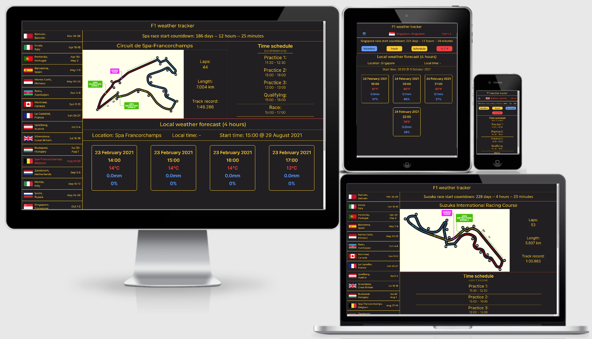

---

## Contents

- [**User Experience Design (UXD)**](#user-experience-design-uxd)

  - [Strategy](#strategy)
    - Goal
    - User stories
  - [Scope](#scope)
    - Functional specifications
    - Content requirements
  - [Structure](#structure)
    - Information architecture
    - Interaction design
  - [Skeleton](#skeleton)
    - Wireframes
  - [Surface](#surface)
    - Colours
    - Typography
    - Uniformity

- [**Features**](#features)

  - Existing features
  - Future features

- [**Technologies**](#technologies)

  - Languages
  - Frameworks
  - Libraries
  - Software

- [**Testing**](#testing)

- [**Deployment**](#deployment)

  - Hosting online
  - Running locally

- [**Credits**](#credits)

  - Code
  - Text
  - Media
  - Miscellaneous
  - Acknowledgements

- [**Notes**](#notes)

---

## User experience design (UXD)

### Strategy

#### Goal

The goal for the website is to provide Formula 1 fans with a single place that contains event specific (weather) information for upcoming races in the 2021 Formula 1 calendar.

#### User stories

- As a **visitor**, I would like **to see a schedule of the Formula 1 calendar**, so that **I know where and when the next event takes place**.

- As a **visitor**, I would like **to know when track sessions are supposed to start**, so that **I can prevent missing the session by accident**.

- As a **visitor**, I would like **to see race event specific weather information**, so that **I can estimate how the weather might influence the track sessions**.

- As a **site owner**, I would like our website **to have an intuitive navigation system**, so that **visitors can easily switch between different race events**.

### Scope

#### Functional specifications

The website should have navigation to switch between race events on the calendar. On tablet and/or mobile there should be navigational buttons to switch between the different sections of information. Content on the website should support different screen sizes. Wherever appropriate and or possible, visible indicators should be shown to users when they can perform an action on the website (like clicking a link or a button).

#### Content requirements

The website needs to display the Formula 1 race calendar for the 2021 season. The website needs to provide weather information relevant to the race time frame for upcoming race events. The website needs to provide the time schedule for each event. The website needs to provide relevant track information for each event.

### Structure

#### Information architecture

This website uses a single page layout, so everything is either visible already or at maximum 2 clicks away depending on your device. On smaller screen sizes you will be able to switch between different sections of information by clicking a button. To see a visual sitemap [click here](wireframes/wireframes-new/visual-sitemap.png).

#### Interaction design

Users can click on a race calendar event to display information relevant to that event. Depending on their device, users could see through visible indicators like changes of colour and/or changing mouse pointers whether something is clickable. Users can also see which events have already taken place through colour indications. Users with touchscreens can swipe up and down to scroll through the page, and they can (double)tap to select race event and browse through the information displayed on the website. If a weather radar is implemented users should be able to pause and play the footage with a single tap or click. A button might be implemented that lets users switch between Celsius and Fahrenheit with a single tap or click. No audio will be used in this website.

#### Function call structure

After I was done with most of the coding, I made flowcharts of the function call chains. I did this for both the desktop and mobile website page load. It gave me a simple overview of the order of the function calls and their purpose. I wasn't sure if and where to put this in the README.md file, but the structure section seemed the most fitting.

To see a flowchart of the desktop page load [click here](wireframes/wireframes-new/function-flowchart-desktop.png).

To see a flowchart of the mobile page load [click here](wireframes/wireframes-new/function-flowchart-mobile.png).

### Skeleton

On bigger screen sizes the entire race calendar will be positioned on the left of the page. On the right side of the page all the information for the selected race event will be displayed. On the top of the right side is a race countdown timer. Below that are the track information and time schedule displayed side by side. Below that a 4 hour weather forecast and the local time are displayed. On smaller screen sizes only the selected calendar event is displayed. Below it is the race countdown timer. Below that several buttons are displayed to switch between the different sections of information and there is also a button to switch between Celsius and Fahrenheit. Below that the currently selected section of information is displayed.

Before starting to code I decided to create a quick skeleton mock-up which you can see by [clicking here](wireframes/wireframes-new/skeleton-mockup.png)

#### Wireframes

To see all the wireframes in a single PDF [click here](wireframes/wireframes-new/f1weather-ALL-wireframes-PDF.pdf).

To see separate image files of the wireframes check the wireframes-new/seperate-wireframe-images folder.

### Surface

#### Colours

My initial plan regarding the colour scheme is to use a grey and yellow colour palette with red as a supplementary option. I ended up also adding blue as a supplementary colour option. I have kept with my initial plan and used grey and yellow throughout most of the website. I ended up using the red colour to separate between the different data areas (track, time and weather information), to indicate the active event, for the temperature unit button and for the temperature data itself. I used the blue colour to indicate the active data type button in the data dashboard, for the hamburger menu icon, for the rain and the precipitation data. The colour scheme has good contrast between each of the colours and everything is clearly readable.

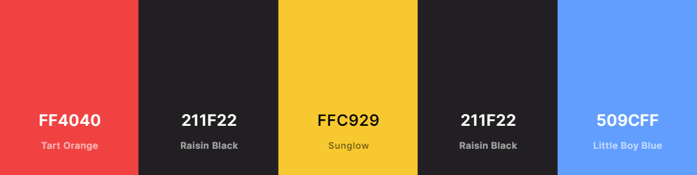

#### Typography

My initial plan regarding the typography is to use at least 2 different font-styles to separate the weather data from the other content. My final choices of font-styles ended up being 'Montserrat' and 'Inter' from the Google Fonts library. Montserrat is what I consider more of a softer font-style, so I used Montserrat for the calendar items, track name and weather title container. Whereas Inter is quite a sharp font-style, which I used for all the data related text content.

#### Uniformity

To keep the website looking uniform I'm trying to make sure that all related contents throughout the website are consistent in font size and styling. The positioning of elements and contents should be consistent in height, padding and spacing. I'm also using either grid, flexbox or both to present the content in a logical order.

**_[Back to top](#contents)_**

---

## Features

### Existing features

#### General features

**Top (navigation) bar**:

- Will always be visible at the top of the page.
- Has the name of the website in the center.

**Race calendar**:

- Will be displayed left on the page on large screen sizes. On smaller screen sizes a single calendar event will be displayed below the top (navigation) bar.
- A country flag, race location and date are displayed. Additionally a hamburger menu icon will be displayed on smaller screen sizes.
- There are 23 rows, one for each event on the 2021 Formula 1 race calendar.
- When you hover an event item with the mouse the color(s) and mouse pointer change.
- When an event has taken place the color(s) change.
- Clicking on an event item changes the information displayed in the race countdown timer, track information, event time schedule and 4 hour weather forecast features.
- On smaller screen sizes the calendar can be displayed by a single tap/click on a race event item.

**Race countdown timer**:

- Will be displayed below the top (navigation) bar.
- A countdown to the race start for the currently selected race event showing the days, hours and minutes is displayed.

**Track information**:

- Will be displayed below the race countdown timer on large screen sizes. On smaller screen sizes the track information can be displayed below the button dashboard.
- Track name, track map, total number of race laps, track length and track record of the currently selected race event are displayed.

**Event time schedule**:

- Will be displayed below the race countdown timer and right of the track information features on large screen sizes. On smaller screen sizes the event time schedule can be displayed below the button dashboard.
- Track session times of the currently selected race event are displayed in the local time of the event location.

**4 hour weather forecast**:

- Will be displayed below the track information and event time schedule features on large screen sizes. On smaller screen sizes the 4 hour weather forecast can be displayed below the button dashboard.
- The location, the current local time and the local start time of the race are displayed.
- Textual weather forecast information for the next 4 hours around the race start time at the selected race event location are displayed.

**Button dashboard**:

- Only visible at smaller screen sizes, will be displayed below the race countdown timer.
- There are 4 buttons, clicking on them changes which type of feature section is displayed below or changes between Celsius or Fahrenheit.

#### Page specific features

None, the website uses a single page layout.

### Future features

- An actual 3 hour rainfall forecast radar could be added to create a 3 hour weather forecast feature.

- A 24 hour weather forecast feature could be added.

- A 7 day weather forecast feature could be added.

- A second page could be added where visitors can select race locations that are not on the current Formula 1 calendar.

- A feature that allows visitors to get email notifications several days prior to a race events could be added.

- A current local time feature (tried to implement it already, but was too difficult without a back-end).

**_[Back to top](#contents)_**

---

## Technologies

### Languages

- [HTML5](https://developer.mozilla.org/en-US/docs/Web/Guide/HTML/HTML5) - for the structuring of the website.

- [CSS3](https://developer.mozilla.org/en-US/docs/Archive/CSS3) - for the styling and responsiveness of the website.

- [JavaScript](https://developer.mozilla.org/en-US/docs/Web/JavaScript) - for the (interactive) functionality of the website.

### Frameworks

None

### Libraries

- [Google Fonts](https://fonts.google.com/) - for the Montserrat and Inter font-family.

- [Font Awesome](https://fontawesome.com/) - for the hamburger menu icon.

### API's

- [World Weather Online](https://www.worldweatheronline.com/developer/api/docs/local-city-town-weather-api.aspx/) - for the local weather data.

### Software

- [Balsamiq](https://balsamiq.com/) - for creating the wireframes.

- [Visual Studio Code (desktop version)](https://code.visualstudio.com/) - for coding and creating the project.

- [Git (BASH)](https://gitforwindows.org/) - for version control in the VSCode terminal.

- [Google Chrome](https://www.google.com/chrome/) - for testing the website with their devtools.

**_[Back to top](#contents)_**

---

## Testing

A separate file with testing information can be found [here](testing/TESTING.md).

**_[Back to top](#contents)_**

---

## Deployment

### Hosting online

This project was hosted on [GitHub Pages](https://pages.github.com/) with the following steps:

1. Log into [GitHub](https://github.com/login).
2. Go to your repositories.
   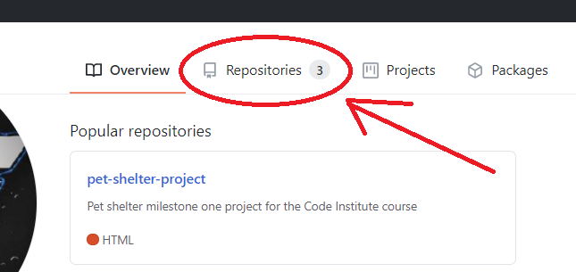
3. Click on the repository that you'd like to host.
4. From the menu tabs click on settings.
   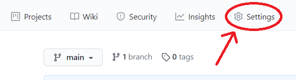
5. Scroll down to the GitHub Pages section.
6. Select the main branch and press save.
   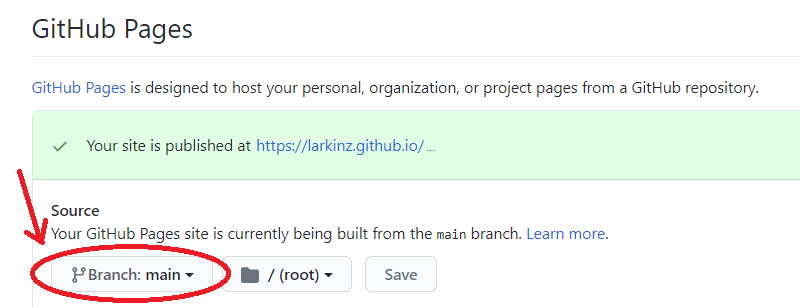
7. Scroll back down to the GitHub Pages section.
8. Find your published website link there.
   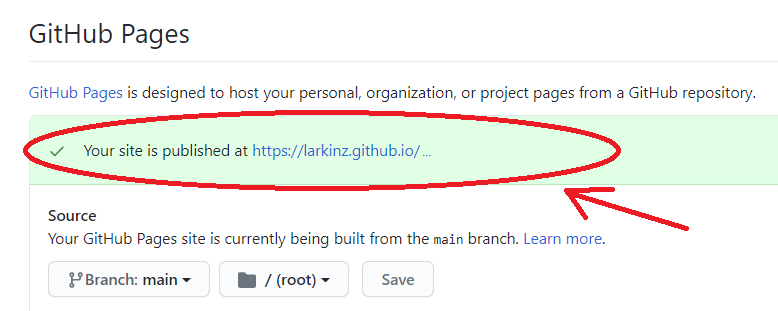
9. The website should now be deployed after a couple of minutes. (GitHub says processing can take up to 20 minutes)

### Running locally

To run my project locally I'd suggest the following steps:

1. At my [project repository page](https://github.com/Larkinz/F1-weather-tracker) click the download button.
   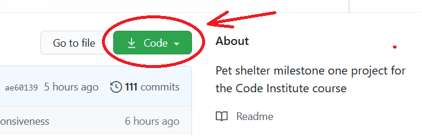
2. Select the ZIP download option and save it somewhere on your computer.
   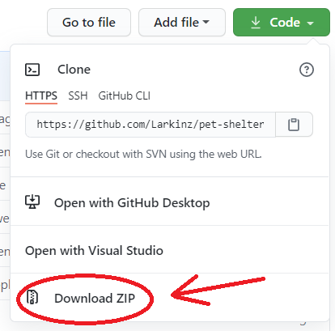
3. Extract the content of the ZIP file in a folder on your computer.
4. Download and install the appropriate version of [Visual Studio Code](https://code.visualstudio.com/download) for your computer.
5. Open Visual Studio Code.
6. In the top left corner select 'file' and then click on 'open folder'.
   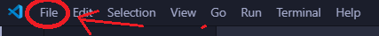  
   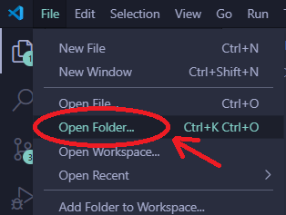
7. Select the folder in which you extracted the repository files.
8. On the left side click on the extensions tab.
   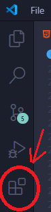
9. Search for 'live server' and install the one made by Ritwick Dey.
   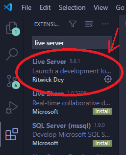
10. Click the index.html tab.
    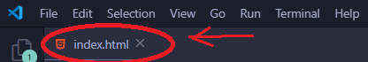
11. On the bottom right click on 'Go Live'.
    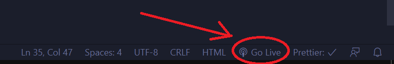
12. A local version of the website should now open in your standard browser.

**_[Back to top](#contents)_**

---

## Credits

All numbered references below correspond with a comment in either the HTML, CSS or JavaScript code.

### Code

#1: Used [this code](https://javascript.info/async-await#error-handling) creating try/catch error handling block.

#2: Referenced [lecture 258 'Consuming Promises with Async/Await'](https://www.udemy.com/course/the-complete-javascript-course/learn/lecture/22649375) from the Udemy course 'The Complete JavaScript Course 2021: From Zero to Expert!' by Jonas Schmedtmann to build a function that fetches my API weather data.

#3: Referenced [this online explanation](https://coderwall.com/p/ewxn9g/storing-and-retrieving-objects-with-localstorage-html5) from https://coderwall.com/ about storing and retrieving objects with localStorage to store and retrieve my API weather data from localStorage.

#4: Used [this code snippet](https://stackoverflow.com/a/47437070) from https://stackoverflow.com/ to manipulate the date format in the weather elements to my preference.

#5: Referenced [this code snippet](https://stackoverflow.com/a/51639047) from https://stackoverflow.com/ on how to read HTML element CSS properties in JavaScript.

#6: Used [this code snippet](https://www.codegrepper.com/code-examples/javascript/js+detect+screen+size+change) from https://codegrepper.com/ to detect changes in window size.

#7: Referenced [this code snippet](https://www.w3schools.com/howto/howto_js_countdown.asp) from https://w3schools.com/ to build a countdown timer for the race starts.

### Media

#8: Country flag images taken from the [official Formula 1 website](https://www.formula1.com/).

#9: Track map images taken from the [official Formula 1 website](https://www.formula1.com/).

### Miscellaneous

- Used https://coolors.co/ to create an image of my colour palette (see ['Surface'](#surface) section of the README).

- Used https://autoprefixer.github.io/ to add vendor prefixes to CSS rules for better browser compatibility.

### Acknowledgements

placeholder text

**_[Back to top](#contents)_**

---

## Notes

- A

- B

- C

**_[Back to top](#contents)_**

---
