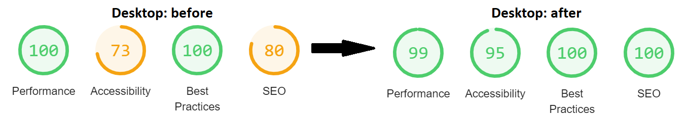
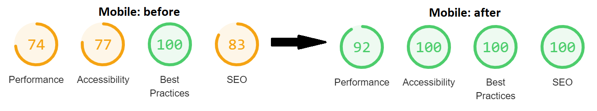
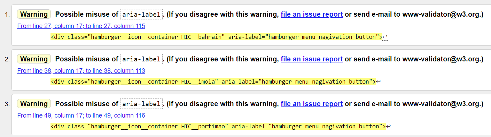
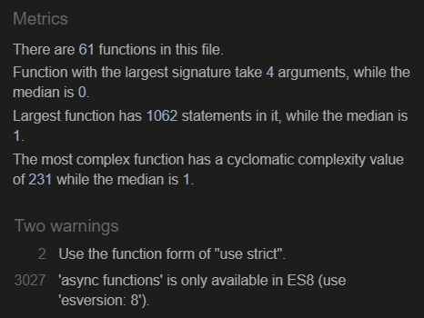

# Testing

View live version of the website [here](https://larkinz.github.io/F1-weather-tracker/).

Milestone Project 2: Interactive Front-end Development – [Code Institute](https://codeinstitute.net/)

In this document you will find information about the testing procedures that I have used to make sure the website displays and functions correctly on most browsers and devices.

---

## Contents

- [**Browser compatibility**](#browser-compatibility)

  - Tested browsers and devices
  - What I tested
  - Browser compatibility testing results

- [**Mobile responsiveness**](#mobile-responsiveness)

- [**Lighthouse**](#lighthouse)

- [**Code validators**](#code-validators)

  - W3C - Markup Validation Service
  - W3C - CSS Validation Service
  - JSHint - JavaScript code quality checker

- [**Test cases**](#test-cases)

- [**Testing user stories**](#testing-user-stories)

- [**Bugs**](#bugs)

  - Solved bugs
  - Known bugs

---

## Browser compatibility

### Tested browsers and devices

I tested these browser versions on these devices:

**Desktop PC (64-bit, Windows 10):**

- Google Chrome Version 88.0.4324.190 (Official Build) (64-bit)
- Firefox Version 86.0 (64-bit)
- Microsoft Edge Version 88.0.705.74 (Official build) (64-bit)
- Safari (via https://www.browserstack.com/)

**Dell E7240 laptop (64-bit, Windows 10):**

- Opera Version 74.0.3911.160 (64-bit)

**Samsung Galaxy S7 (Android Version 8.0.0):**

- Samsung internet Version 9.2.00.70
- Samsung internet Version 13.2.2.4
- Brave Browser Version 1.18.75

### What I tested

List of things that I tested:

- If things display in the correct order
- If things display in the correct size
- If images display correctly
- If all internal links work
- If hover effects work
- If the JavaScript functionality works

### Browser compatibility testing results

**Google Chrome Version 88.0.4324.190 (Official Build) (64-bit):**

Everything is working and displaying as intended.

**Firefox Version 86.0 (64-bit):**

Everything is working and displaying as intended.

**Microsoft Edge Version 88.0.705.74 (Official build) (64-bit):**

Everything is working and displaying as intended.

**Safari:**

On basically all the Apple devices that I've tested on [Browserstack](https://www.browserstack.com/) the calendar event is [not displayed](testing-img/ipad-air4-safari14-portrait.png), even when using Safari 14, same as in the old version of Samsung Internet. While using the same device in landscape mode [the calendar is actually visible](testing-img/ipad-air4-safari14-landscape.png) and functions normally. On older iOS devices the website is completely broken, check out the [iPhone 6S](testing-img/iphone6S-safari9.png) for example. None of the Apple devices that I've tested showed the calendar event when in portait mode, [even when using Google Chrome](testing-img/iphone12pro-chrome.png) instead of Safari. The images also don't work unless you are using Safari 14, this was no surprise since https://caniuse.com/webp already showed me that the WebP image format is poorly supported on Safari. I confirmed this by checking both [Safari 13](testing-img/ipad-safari13.png) and [Safari 14](testing-img/ipad-safari14.png) on the same device. I have no clue though why the calendar event is not displayed in portait mode, but this isn't necessarily an iOS only issue since the same issue happened on the old Samsung Internet version on an Android device too.

**Opera Version 74.0.3911.160 (64-bit):**

Everything is working and displaying as intended. [(screenshot)](testing-img/opera-test.png)

**Samsung internet Version 9.2.00.70:**

The race calendar event is not displayed which means there is no nagivation to switch between race events. This issue was also seen at more older browser versions tested on https://www.browserstack.com/ and this same issue was present on most iOS devices that I've tested. [(screenshot)](testing-img/sams-int-v9.jpg)

**Samsung internet Version 13.2.2.4:**

Everything is working and displaying as intended. [(screenshot 1)](testing-img/sams-int1-v13.jpg) [(screenshot 2)](testing-img/sams-int2-v13.jpg)

**Brave Browser Version 1.18.75:**

Everything is working and displaying as intended. [(screenshot)](testing-img/brave-test1.jpg)

**_[Back to top](#contents)_**

---

## Mobile responsiveness

To test the website for mobile responsiveness I've been using the [Google Chrome devtools](testing-img/chrome-devtools.png) throughout the coding of the media queries. I manually used the sliders to go through different screen sizes. I've also used all of the [pre-configured screen sizes](testing-img/devtools-phones.png) in the devtools to test if things looked okay. I've also used https://responsivedesignchecker.com/ for some additional mobile responsiveness testing throughout the building of the website, since the Google Chrome devtools can behave a bit strange at times it's good to test responsiveness with more than a single tool.

**_[Back to top](#contents)_**

---

## Lighthouse

In the Google Chrome devtools I have used the [Lighthouse feature](testing-img/google-lighthouse.png) to check: performance, accessibility, best practices and SEO indicators for my website. I recorded before and after scores of both the desktop and mobile tests. The performance score metric seemed somewhat unreliable, since scores deviated without changes to the website. The images below this paragraph show the score before making changes to my website, and the best scores that I've managed to achieve after making some of the recommended changes. I improved the performance score by: converting all my images from PNG to WebP on the https://ezgif.com/png-to-webp website, adding '&display=swap' to my Google Fonts, and by preloading my CSS stylesheet. After the performance improvements I did some network tests to check if the loading time had decreased, and it did quite significantly. In the slow 3G network mode the loading speed went from 52 seconds down to 31 seconds for instance. I improved the accessibility score by adding an aria-label in the HTML code to the hamburger menu icons, and by adding ALT-tags to all my images. The SEO score was simply improved by adding meta tags in the HTML head element with a description of the website and keywords.

**_[Back to top](#contents)_**

---

## Code validators

### W3C - Markup Validation Service

I've put the HTML code through the [W3C markup validator](https://validator.w3.org/) and got no errors, all I got were some warnings about the aria-labels on the hamburger menu icons:

These warnings were easily fixed by adding role="navigation" to the same div elements, after which the code [passed without warning or errors](testing-img/HTML-pass.png).

### W3C - CSS Validation Service

I've put my style.css file through the [W3C CSS validator](https://jigsaw.w3.org/css-validator/) and it [passed without errors](testing-img/CSS-pass.png) on the first try.

### JSHint - JavaScript code quality checker

I've put my script.js file through the [JSHint validator](https://jshint.com/) and it gave some warnings about unnecessary use of semicolons. After removing those I only got 2 ignorable warnings:

**_[Back to top](#contents)_**

---

## Test cases

placeholder text

**_[Back to top](#contents)_**

---

## Testing user stories

- As a visitor, I would like to see a schedule of the Formula 1 calendar, so that I know where and when the next event takes place.

Large screen sizes:

1. When the visitor enters the website, they will immediately see the full 2021 Formula 1 calendar including the event location and dates on the left of the page.

Smaller screen sizes:

1. When the visitor enters the website, they will see the closest 2021 Formula 1 calendar event below the top (navigation) bar.
2. After clicking on this single calendar event the full 2021 Formula 1 calendar including the event location and dates will be displayed.

---

- As a visitor, I would like to know when track sessions are supposed to start, so that I can prevent missing the session by accident.

Large screen sizes:

1. When the visitor enters the website, they will immediately see a time schedule of the currently selected event on the right of the page.

Smaller screen sizes:

1. When the visitor enters the website, they will see a button dashboard with a button labeled 'Schedule'.
2. After clicking on this button the time schedule of the currently selected event will be displayed.

---

- As a visitor, I would like to see race event specific weather information, so that I can estimate how the weather might influence the track sessions.

Large screen sizes:

1. When the visitor enters the website, they will see local weather data of the currently selected event on the right of the page (possibly after scrolling down a little bit, depending on screen size).

Smaller screen sizes:

1. When the visitor enters the website, they will immediately see local weather data of the currently selected event on the bottom of the page.

---

- As a site owner, I would like our website to have an intuitive navigation system, so that visitors can easily switch between different race events.

Large screen sizes:

1. When the visitor enters the website, they will immediately see the full 2021 Formula 1 calendar on the left of the page.
2. Hovering an event on the calendar will change the mouse cursor to pointer and change the colours of the currently hovered event to indicate to the user that it can be clicked.
3. Clicking on a calendar event will change the data displayed on the website to the selected event.

Smaller screen sizes:

1. When the visitor enters the website, they will see the closest 2021 Formula 1 calendar event below the top (navigation) bar.
2. This calendar event has a hamburger menu icon on the left, indicating to the user that it can be selected.
3. After clicking on this single calendar event the full 2021 Formula 1 calendar will be displayed.
4. Clicking on a calendar event will change the data displayed on the website to the selected event.

**_[Back to top](#contents)_**

---

## Bugs

### Solved bugs

- When going back from mobile to desktop view only one data container was displayed instead of all 3. This was fixed by creating the 'allDataContainersVisible' function, which makes all 3 data type containers visible. Then adding that function to the 'checkMainFlexDirection' function, which is triggered by the window.onResize event listener.

- In some situations when going back from mobile to desktop view a hamburger menu icon was visible in a race calendar event, even though this should only happen in mobile view. This was fixed by creating the 'hideAllHamburgerIcons' function, which makes all the hamburger menu icons invisible. Then adding that function to the 'checkMainFlexDirection' function, which is triggered by the window.onResize event listener.

- There was a bug that caused the wrong event data to be displayed when a window resize was detected when simultaneously having the race calendar expanded. This was fixed by adding conditions to the 'checkMainFlexDirection' function that check if the race calendar is expanded or not.

- There was a bug that made the race calendar collapse when window resize was detected while the race calendar was expanded. This was fixed by adding the 'showAllEvents' function (which displays all the calendar events) to the last 'else if' statement in the 'checkMainFlexDirection' function and removing the 'showActiveEventOnly' function.

- There was a bug that caused the wrong format of text to be displayed in the countdown timer container after switching between portrait and landscape mode on mobile devices. This was fixed by adding the 'setInitialCountdown' function (which displays the correct countdown timer based on active event and screen size) to the window.onResize event listener.

- At some point during development I got "_Access to fetch at ... from origin ... has been blocked by CORS policy_" errors. This is apparently some setting that the API provider can enable to block people from calling API's from localhost. I got around this issue by installing the [Moesif Origin & CORS Changer](https://chrome.google.com/webstore/detail/moesif-origin-cors-change/digfbfaphojjndkpccljibejjbppifbc) extension for Google Chrome. Once the CORS errors stopped I removed the extension because I've read that it can cause security weaknesses, and it should only be used during development, then be uninstalled afterwards.

- Apparently the API fetch sometimes returns empty arrays for some of the weather locations, when this happens and you click on that event, then the weather data from the previously active event was displayed in the weather data containers. I fixed this by adding try/catch blocks to all the setting of the weather data JavaScript code, so that it replaces the text contents in the weather containers to generic text, and also the user will get an alert saying that the weather data for that specific event is unavailable.

### Known bugs

- Images don't display when using Safari 13 or older versions, this is because only Safari 14 supports the WebP image format. ([see screenshot](testing-img/ipad-safari13.png)).

- The calendar event (which is necessary for navigation between events) doesn't display on (nearly) all iOS devices with smaller screen sizes. So iOS users can only see data of the closest race event. ([see screenshot](testing-img/iphone12pro-chrome.png)).

- On older iPhones the website seems to be completely broken. ([see screenshot](testing-img/iphone6S-safari9.png)).

- Sometimes when you refresh the website multiple times in quick succession on a mobile device, the race calendar will stay expanded until you scroll or select an event.

- There is no information displayed in the local time container. The reason for this is that it was too difficult to implement this feature without a back-end, but I didn't want to remove the feature container, because I will probably host an actual website from this project that does allow me to use a back-end and implement it.

**_[Back to top](#contents)_**

---
